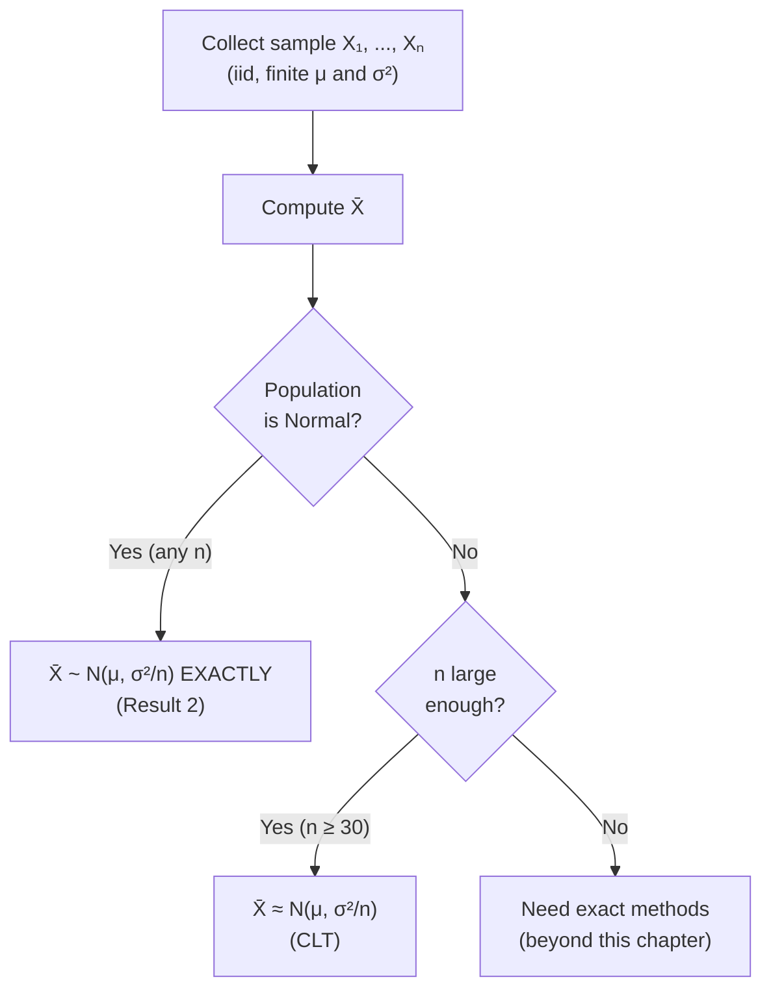

# Chapter 5: LLN, Convolutions & the Central Limit Theorem

> [!abstract] What's This Chapter About?
> This chapter answers a fundamental question in statistics: **why does averaging lots of data give us reliable estimates?** We'll cover three big ideas:
> 1. **Law of Large Numbers** — the sample mean *eventually* hits the true mean
> 2. **Convolutions** — what distribution do you get when you add random variables?
> 3. **Central Limit Theorem** — the sample mean is *approximately normal* for large samples, no matter the original distribution

---

## 1. Law of Large Numbers (LLN)

### The Core Idea

Imagine you flip a fair coin. You *know* the probability of heads is 0.5, but if you only flip it 5 times you might get 4 heads. That doesn't mean the coin is unfair — it just means your sample is small.

**The Law of Large Numbers says:** as you collect more and more data, your sample average will get closer and closer to the true expected value.

> [!tip] Plain English Version
> The more data you have, the more your sample average $\bar{X}$ looks like the true population mean $E(X)$.

### Formal Statement

Let $X_1, X_2, \ldots, X_n$ be **iid** (independent and identically distributed) random variables, and let $g$ be any function where $E[g(X_1)]$ is finite. Then for any small number $\epsilon > 0$:

$$P\left(\left|\frac{1}{n}\sum_{i=1}^{n} g(X_i) - E[g(X_1)]\right| > \epsilon\right) \to 0 \quad \text{as } n \to \infty$$

**In simpler terms:** The probability that your sample average is *far from* the true expected value shrinks to zero as $n$ grows.

> [!note] Key Vocabulary
> - **Converges in probability**: We say $\bar{X}$ *converges in probability* to $E(X_1)$, written $\bar{X} \xrightarrow{p} E(X_1)$
> - **Consistent estimator**: $\bar{X}$ is called a *consistent estimator* of $E(X_1)$ because it reliably gets closer to the truth as $n$ increases

### What About the Sample Proportion $\hat{p}$?

The sample proportion $\hat{p}$ (fraction of successes) is actually just a sample mean! So by the LLN:

$$\hat{p} \xrightarrow{p} p \quad \text{(the true probability)}$$

This is why polling works — a large enough sample proportion is a reliable estimate of the true population proportion.

### ⚠️ Limitation: When LLN Fails

The LLN requires that $E(X)$ is **finite**. Not all distributions have finite expectations!

> [!warning] LLN Limitation Example
> Consider the random variable $X$ with PDF:
> $$f(x) = \frac{1}{x^2}, \quad 1 \leq x < \infty$$
> Check the expected value:
> $$E(X) = \int_1^{\infty} x \cdot \frac{1}{x^2}\, dx = \int_1^{\infty} \frac{1}{x}\, dx = \ln(x)\Big|_1^{\infty} = \infty$$
> Since $E(X) = \infty$, the LLN **does not apply** here. No matter how many samples you take, $\bar{X}$ won't settle down to a fixed value.

---

## 2. Convolutions

### The Core Idea

A **convolution** just asks: *if I add two independent random variables together, what distribution does the result follow?*

> [!tip] Plain English Version
> If $X$ and $Y$ are independent, the distribution of $X + Y$ is called the *convolution* of $X$ and $Y$.

### Known Convolution Results

These are the "nice" cases where the sum stays in the same distribution family:

| Distribution | $X \sim$ | $Y \sim$ | $X + Y \sim$ |
|---|---|---|---|
| **Binomial** | $\text{Bin}(n_1, p)$ | $\text{Bin}(n_2, p)$ | $\text{Bin}(n_1 + n_2,\, p)$ |
| **Poisson** | $\text{Poisson}(\lambda_1)$ | $\text{Poisson}(\lambda_2)$ | $\text{Poisson}(\lambda_1 + \lambda_2)$ |
| **Normal** | $N(\mu_1, \sigma_1^2)$ | $N(\mu_2, \sigma_2^2)$ | $N(\mu_1 + \mu_2,\, \sigma_1^2 + \sigma_2^2)$ |

> [!warning] Important Condition
> These results **only hold when $X$ and $Y$ are independent**. Do not apply them to correlated variables!

> [!example] Intuition for the Binomial Case
> If $X$ counts successes in $n_1$ trials and $Y$ counts successes in $n_2$ trials (same $p$), then $X + Y$ counts successes across all $n_1 + n_2$ trials. Makes sense!

### Result 1: Linear Combinations of Normals

This is a more powerful version of the convolution idea.

**Setup:** Let $X_1, \ldots, X_n$ be **independent** (not necessarily identical) with $X_i \sim N(\mu_i, \sigma_i^2)$. Form a linear combination:

$$Y = a_1 X_1 + a_2 X_2 + \cdots + a_n X_n$$

**Then:**

$$Y \sim N(\mu_Y,\, \sigma_Y^2)$$

where:
$$\mu_Y = a_1\mu_1 + a_2\mu_2 + \cdots + a_n\mu_n$$
$$\sigma_Y^2 = a_1^2\sigma_1^2 + a_2^2\sigma_2^2 + \cdots + a_n^2\sigma_n^2$$

> [!tip] Why Does the Variance Get Scaled by $a_i^2$?
> Remember: $\text{Var}(aX) = a^2 \text{Var}(X)$. Stretching or shrinking a variable by $a$ scales the variance by $a^2$.

> [!example] Worked Example — SAT Scores
> Math scores: $X \sim N(529, 5732)$
> Verbal scores: $Y \sim N(474, 6368)$
>
> **Question:** What is $P(X > Y)$, i.e., $P(X - Y > 0)$?
>
> **Step 1:** Define $D = X - Y = X + (-1)Y$. This is a linear combination with $a_1 = 1$, $a_2 = -1$.
>
> **Step 2:** Find the distribution of $D$:
> $$\mu_D = 1(529) + (-1)(474) = 55$$
> $$\sigma_D^2 = (1)^2(5732) + (-1)^2(6368) = 5732 + 6368 = 12100$$
>
> So $D \sim N(55, 12100)$, meaning $\sigma_D = \sqrt{12100} = 110$.
>
> **Step 3:** Standardize and look up:
> $$P(D > 0) = P\!\left(Z > \frac{0 - 55}{110}\right) = P(Z > -0.5) = P(Z < 0.5) \approx 0.6915$$

### Result 2: Distribution of the Sample Mean (Normal Population)

If data comes from a **normal** distribution, the sample mean is *also* exactly normal:

> [!note] Key Result
> If $X_1, \ldots, X_n$ are iid $N(\mu, \sigma^2)$, then:
> $$\bar{X} \sim N\!\left(\mu,\; \frac{\sigma^2}{n}\right)$$
> - Mean of $\bar{X}$: same as the population mean $\mu$
> - Variance of $\bar{X}$: $\sigma^2 / n$ — it *shrinks* as $n$ grows!

> [!tip] Intuition: Why Does Variance Shrink?
> Averaging "smooths out" random variation. If you average 100 measurements, extreme values cancel each other out. That's why $\bar{X}$ has variance $\sigma^2/n$, not $\sigma^2$.

> [!example] Worked Example — Required Sample Size
> Population: $N(\mu, \sigma^2 = 4)$, so $\sigma = 2$.
>
> **Goal:** Find $n$ such that $P(|\bar{X} - \mu| \leq 0.5) = 0.90$.
>
> **Step 1:** Standardize. $\bar{X} \sim N(\mu, 4/n)$, so $\frac{\bar{X} - \mu}{2/\sqrt{n}} \sim N(0,1)$.
>
> **Step 2:** Rewrite the probability:
> $$P\!\left(|Z| \leq \frac{0.5}{2/\sqrt{n}}\right) = 0.90$$
>
> **Step 3:** From the standard normal table, $P(|Z| \leq 1.645) = 0.90$.
>
> **Step 4:** Solve:
> $$\frac{0.5\sqrt{n}}{2} = 1.645 \implies \sqrt{n} = \frac{1.645 \times 2}{0.5} = 6.58 \implies n \approx 43.3$$
>
> **Round up:** $n = 44$ (always round up for "at least" conditions).

---

## 3. The Central Limit Theorem (CLT)

### The Core Idea — The Most Important Theorem in Statistics

Result 2 above only works when the *population itself* is normal. But what about real-world data that follows a weird, skewed, or unknown distribution?

**The CLT says:** it doesn't matter! For a *large enough sample*, the sample mean $\bar{X}$ is approximately normal **regardless of the original distribution**.

> [!success] Central Limit Theorem (CLT)
> Let $X_1, \ldots, X_n$ be iid with finite mean $\mu$ and finite variance $\sigma^2$.
> For large enough $n$:
>
> **The sample mean:**
> $$\bar{X} \;\dot{\sim}\; N\!\left(\mu,\, \frac{\sigma^2}{n}\right)$$
>
> **The total sum:**
> $$T = X_1 + \cdots + X_n \;\dot{\sim}\; N(n\mu,\, n\sigma^2)$$
>
> ($\dot{\sim}$ means "approximately distributed as")

> [!tip] Why Is This Amazing?
> Your data could be exponential, uniform, binomial, or some crazy distribution you've never seen before — as long as $n$ is large, $\bar{X}$ will still behave like a normal random variable. This is why the normal distribution appears *everywhere* in real-world statistics.

### How Large Is "Large Enough"?

A common rule of thumb: **$n \geq 30$** is usually sufficient. However:
- If the population is already close to normal → even $n = 10$ may work
- If the population is very skewed → you may need $n > 50$ or more

### The Standardized Form

To use the CLT in practice, standardize $\bar{X}$:

$$Z = \frac{\bar{X} - \mu}{\sigma / \sqrt{n}} \approx N(0, 1)$$

This $Z$-score is what you look up in the standard normal table.

> [!example] Worked Example — Chemical Impurity
> Chemical batches have impurity level with $\mu = 4.0\%$ and $\sigma = 1.5\%$.
> Random sample of $n = 50$ batches.
>
> By CLT: $\bar{X} \;\dot{\sim}\; N\!\left(4.0,\; \frac{1.5^2}{50}\right) = N(4.0,\; 0.045)$
>
> So $\sigma_{\bar{X}} = 1.5/\sqrt{50} \approx 0.2121$.
>
> ---
> **Part a:** Find $P(3.5 \leq \bar{X} \leq 3.8)$
>
> Standardize both bounds:
> $$Z_1 = \frac{3.5 - 4.0}{0.2121} \approx -2.36 \qquad Z_2 = \frac{3.8 - 4.0}{0.2121} \approx -0.94$$
>
> $$P(-2.36 \leq Z \leq -0.94) = \Phi(-0.94) - \Phi(-2.36)$$
> $$= 0.1736 - 0.0091 = 0.1645$$
>
> ---
> **Part b:** Find the 95th percentile of $\bar{X}$
>
> The 95th percentile of $Z$ is $z_{0.95} = 1.645$.
>
> Back-transform:
> $$\bar{X}_{0.95} = \mu + z_{0.95} \cdot \sigma_{\bar{X}} = 4.0 + 1.645 \times 0.2121 \approx 4.349\%$$

---

## 4. Normal Approximation to the Binomial

### The Core Idea

When $n$ is large, computing exact binomial probabilities is tedious. The CLT gives us a shortcut: **approximate the Binomial with a Normal**.

> [!note] DeMoivre-Laplace Theorem
> If $T \sim \text{Bin}(n, p)$, then for large $n$:
> $$T \;\dot{\sim}\; N(np,\; np(1-p))$$
>
> This makes sense because:
> - $E(T) = np$ → becomes the normal mean
> - $\text{Var}(T) = np(1-p)$ → becomes the normal variance

> [!tip] Rule of Thumb for "Large Enough"
> The approximation is good when **both** $np \geq 5$ and $n(1-p) \geq 5$.

### Continuity Correction

There's a subtle issue: $T$ is **discrete** (counts), but a normal distribution is **continuous**. To bridge this gap, we use the **continuity correction** — shifting by 0.5.

Let $T \sim \text{Bin}(n,p)$ and $Y \sim N(np, np(1-p))$:

| What you want | What to calculate |
|---|---|
| $P(T \leq k)$ | $P(Y \leq k + 0.5)$ |
| $P(T = k)$ | $P(k - 0.5 < Y < k + 0.5)$ |
| $P(T \geq k)$ | $P(Y \geq k - 0.5)$ |
| $P(a \leq T \leq b)$ | $P(a - 0.5 \leq Y \leq b + 0.5)$ |

> [!tip] Why ±0.5?
> Think of it visually. The discrete bar for "$T = k$" has width 1, centered at $k$, so it spans $[k-0.5, k+0.5]$. The continuity correction captures the *full area* of that bar in the continuous approximation.

> [!example] Worked Example — Seatbelts
> 60% of drivers always wear seatbelts. Sample $n = 500$ drivers. $X$ = number who always wear seatbelt.
>
> ---
> **Part a: Exact distribution**
> $$X \sim \text{Bin}(500, 0.6)$$
> In R: `pbinom(320, 500, 0.6) - pbinom(269, 500, 0.6)` ≈ **0.9marginally** (exact value from R)
>
> ---
> **Part b: Normal approximation with continuity correction**
>
> Parameters:
> $$np = 500(0.6) = 300, \quad np(1-p) = 500(0.6)(0.4) = 120$$
> $$\sigma = \sqrt{120} \approx 10.954$$
>
> Apply continuity correction: $P(270 \leq X \leq 320) \approx P(269.5 \leq Y \leq 320.5)$
>
> Standardize:
> $$Z_1 = \frac{269.5 - 300}{10.954} \approx -2.78 \qquad Z_2 = \frac{320.5 - 300}{10.954} \approx 1.87$$
>
> $$P(-2.78 \leq Z \leq 1.87) = \Phi(1.87) - \Phi(-2.78)$$
> $$\approx 0.9693 - 0.0027 = 0.9666$$

---

## 5. Summary & Big Picture

### Key Formulas Cheat Sheet

| Result | Formula | When to Use |
|---|---|---|
| LLN | $\bar{X} \xrightarrow{p} \mu$ | Conceptual justification for estimation |
| Sampling dist. (Normal pop.) | $\bar{X} \sim N(\mu, \sigma^2/n)$ | Population is exactly normal |
| CLT — sample mean | $\bar{X} \;\dot{\sim}\; N(\mu, \sigma^2/n)$ | Any population, large $n$ |
| CLT — sum | $T \;\dot{\sim}\; N(n\mu, n\sigma^2)$ | Any population, large $n$ |
| Normal approx to Binomial | $T \;\dot{\sim}\; N(np, np(1-p))$ | Binomial with large $n$ |
| Z-score | $Z = \frac{\bar{X} - \mu}{\sigma/\sqrt{n}}$ | Standardizing for table lookup |

> [!success] The Thread Connecting Everything
> - **LLN**: tells us *that* $\bar{X}$ converges to $\mu$
> - **CLT**: tells us *how* $\bar{X}$ is distributed while converging — approximately Normal
> - **Continuity correction**: makes the Normal approximation more accurate for discrete distributions

---

## 6. Common Mistakes to Avoid

> [!bug] Mistake 1: Forgetting to Divide $\sigma$ by $\sqrt{n}$
> When standardizing $\bar{X}$, always use $\sigma_{\bar{X}} = \sigma/\sqrt{n}$, **not** $\sigma$.
> The variance of $\bar{X}$ is $\sigma^2/n$, so its standard deviation is $\sigma/\sqrt{n}$.

> [!bug] Mistake 2: Applying Convolution to Dependent Variables
> $X + Y \sim N(\mu_1 + \mu_2, \sigma_1^2 + \sigma_2^2)$ only holds when $X$ and $Y$ are **independent**!

> [!bug] Mistake 3: Forgetting Continuity Correction
> When approximating a Binomial (or any discrete distribution) with a Normal, always add/subtract 0.5 for better accuracy. It's especially important when the interval boundaries are integer values.

> [!bug] Mistake 4: Rounding Sample Size Down
> When solving for a required sample size $n$, **always round up**. Rounding down would leave you below the required probability guarantee.
