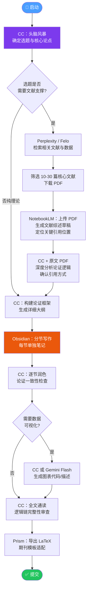
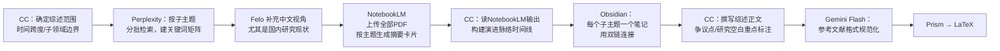
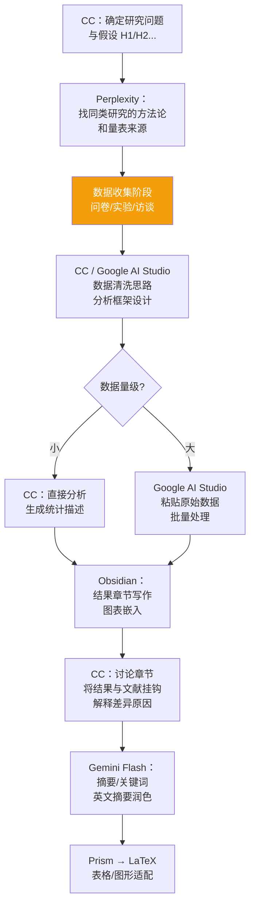
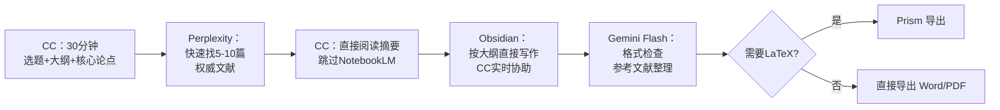
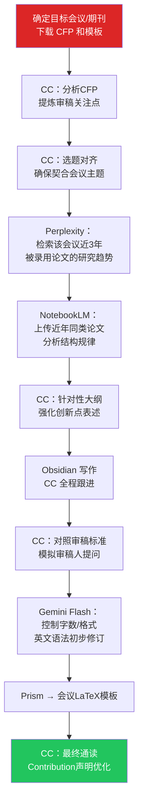

# AI 驱动论文写作工作流

> [!abstract] 设计理念
> 本工作流以**分工明确、减少重复、保持上下文连贯**为核心原则。每个 AI 工具只做它最擅长的事，Obsidian 作为唯一的写作主场，Claude Code (CC) 作为全程中枢协调者。

---

## 工具角色总览

| 工具 | 核心职能 | 何时使用 |
|------|----------|----------|
| **Claude (CC / Sonnet / Opus)** | 选题、论证结构、写作、修改、中枢协调 | 全程 |
| **Perplexity** | 英文学术文献检索、带来源的事实核查 | 找英文参考文献 |
| **Felo** | 中文学术检索、中文数据库覆盖 | 找中文参考文献 |
| **NotebookLM** | 上传 PDF 做深度综述、跨文献问答 | 文献消化阶段 |
| **Google AI Studio** | 超长上下文分析（免费 Gemini 2.0 Flash） | 大批量文本分析 |
| **Gemini Flash（免费无限对话）** | 小改、格式调整、快速回答碎片问题 | 全程救急 |
| **Obsidian + CC** | 正式写作、笔记管理、草稿迭代 | 写作阶段 |
| **Prism** | 将 Obsidian Markdown 转换为 LaTeX | 最终排版输出 |

> [!tip] 关键原则
> - **Perplexity/Felo** 只负责"找"，不负责"读"
> - **NotebookLM** 只读你上传的 PDF，不联网——上传前先筛选
> - **CC** 是你的"大脑外挂"，所有复杂判断都回到 CC
> - **Gemini Flash** 是"零成本消耗品"，用于不值得占用 CC 上下文的小任务

---

## 核心全流程（标准学术论文）



---

## 情境一：综述型论文（Review / Survey）

> [!info] 适用场景
> 毕业论文文献综述章节、独立综述论文、学科进展报告。文献量大（20-80篇），结构以"梳理"为主。



**关键技巧：**
- 在 Obsidian 中为每篇文献建立 `[[文献名]]` 笔记，记录：核心观点、方法、样本、结论、与其他文献的关系
- 用 NotebookLM 的"问答"功能提问："哪些论文对 X 持反对意见？" 快速找到争议点
- CC 最终任务：将碎片化笔记"穿针引线"，形成有叙事弧的综述

> [!warning] 陷阱提醒
> NotebookLM 会产生听起来合理但细节有误的引用。**每个关键引用必须回原文核实页码**。

---

## 情境二：实证研究论文（量化/质性）

> [!info] 适用场景
> 有原始数据的研究论文，含问卷调查、实验数据、访谈记录等。核心挑战是**数据分析与论文写作的衔接**。



**分工细则：**

| 任务 | 工具 | 提示词策略 |
|------|------|-----------|
| 假设演绎 | CC Opus | "我的研究变量是X和Y，帮我推导可验证的操作性假设" |
| 量表选择 | Perplexity | "validated scale for measuring [construct] in [field]" |
| 结果解读 | CC | 粘贴统计输出，"以社会科学论文的语言描述以下结果" |
| 讨论与文献连接 | CC + NotebookLM输出 | 同时提供NotebookLM的综述摘要给CC |
| 英文摘要 | Gemini Flash | 快速润色，不占用CC配额 |

---

## 情境三：课程小论文（快速模式）

> [!info] 适用场景
> 3000-8000 字课程论文，周期短（3-7天），要求不高于顶刊标准。**以速度为优先**。



> [!tip] 快速模式核心提示词
> 给 CC 的启动提示：
> ```
> 我需要写一篇关于[主题]的[字数]课程论文，方向是[学科]。
> 请帮我：1) 提出3个有差异化的论点角度 2) 推荐最优角度并说明理由
> 3) 生成包含引言/3个正文节/结论的详细大纲
> ```

---

## 情境四：会议论文 / 快速投稿

> [!info] 适用场景
> Deadline 紧迫（1-4周），目标期刊/会议已确定，需严格对齐审稿标准。



**针对审稿人的模拟提示词（给 CC）：**
> ```
> 请扮演[领域]顶会的匿名审稿人，对以下论文草稿提出3个最可能被拒稿的弱点，
> 并给出具体的修改建议。论文草稿：[粘贴内容]
> ```

---

## Obsidian 笔记结构建议

```
📁 论文项目/
├── 📄 00_项目总览.md          ← 选题、deadline、状态追踪
├── 📄 01_研究问题与假设.md
├── 📄 02_文献综述.md          ← 从 NotebookLM 输出整合
├── 📁 文献笔记/
│   ├── 📄 [[作者_年份_标题]].md
│   └── ...
├── 📄 03_研究方法.md
├── 📄 04_数据与结果.md
├── 📄 05_讨论.md
├── 📄 06_结论与摘要.md
└── 📄 草稿_全文合并.md        ← 最终合并后交给 Prism
```

> [!note] 双链的价值
> 在正文写作时，随手插入 `[[作者_年份_标题]]` 作为引用占位符，CC 后期可以帮你统一转换为标准引用格式（APA/MLA/GB/T）。

---

## 全程 Prompt 速查卡

### 阶段一：选题（CC）
```
背景：我是[学科]方向的[本科生/研究生]，研究兴趣在[领域]。
目标：一篇[字数]的[类型]论文，要求[有/无]原创数据。
请提供5个具体、可操作、差异化的选题，并标注每个选题的：
- 核心创新点
- 主要挑战
- 可参考的关键词（用于后续文献检索）
```

### 阶段二：文献检索（Perplexity）
```
Find recent academic papers (2020-2025) on [topic].
Focus on: empirical studies, key theories, unresolved debates.
Return: title, authors, year, journal, and 2-sentence summary.
```

### 阶段三：文献综述（NotebookLM → CC）
```
（先在 NotebookLM 生成各文献摘要，导出文本）
将以下文献摘要交给 CC：
"基于以上文献摘要，帮我撰写一段800字的文献综述，
需要体现：研究演进脉络、主要流派争议、现有研究的不足（即我的切入点）"
```

### 阶段四：逐节写作（CC）
```
当前写作第[X]节：[节标题]
本节目标：[说明该节要论证什么]
可用素材：[粘贴相关文献笔记或数据]
上下文：[简述前后节的内容]
字数要求：[X]字，风格：学术严谨，第三人称
```

### 阶段五：修订（CC 模拟审稿）
```
请从以下三个视角逐一审查这段论文草稿，并给出具体修改意见：
1. 逻辑一致性：论点是否自洽，是否有跳跃
2. 文献支撑：哪些论断缺乏引用
3. 语言表达：是否有冗余、歧义或过于口语化的表述
```

---

## 工具成本与配额管理

> [!warning] 避免浪费高价值配额

| 任务类型         | 推荐工具              | 避免使用         |
| ------------ | ----------------- | ------------ |
| 格式调整、标点、字数压缩 | Gemini Flash（免费）  | CC Opus      |
| 单篇文献摘要翻译     | Gemini Flash      | NotebookLM   |
| 数学公式检查       | Gemini Flash / CC | -            |
| 跨文献比较分析      | NotebookLM → CC   | 单独问CC        |
| 超长文本（>50页）分析 | Google AI Studio  | CC（上下文有限）    |
| 核心论证构建       | CC Opus           | Gemini Flash |
| 结构性大改        | CC Sonnet/Opus    | Gemini Flash |

---

## 质量检查清单

在提交前，用 CC 逐项确认：

- [ ] **论点一致性**：摘要、引言、结论的核心论点完全一致
- [ ] **引用规范**：所有引用已回原文核实，格式统一
- [ ] **逻辑跳跃**：每个段落的论据直接支撑段落主题句
- [ ] **研究缺口**：文献综述明确指向本文的创新点
- [ ] **方法透明度**：读者可根据方法章节复现研究
- [ ] **数据呈现**：图表均有标题、来源、说明
- [ ] **字数与格式**：符合期刊/会议要求
- [ ] **参考文献**：数量、格式、年份范围符合要求

---

*最后更新：2026-03-11 · 由 Claudian 生成并优化*
