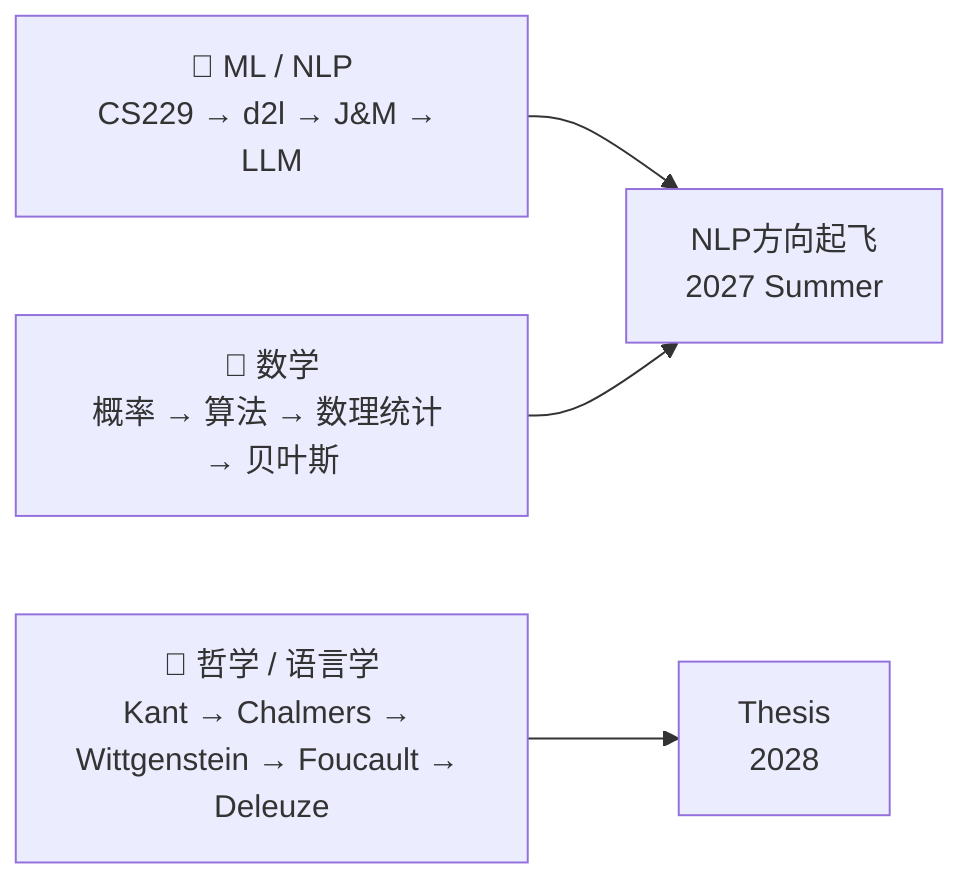
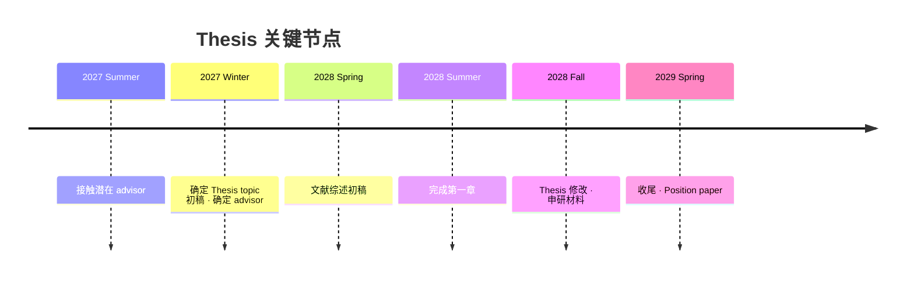

# 自学 / 读书计划 — 总览

> [!abstract] 规划原则
> **打地基，不贪多。** 每个阶段的自学材料服务于即将到来的课程，而不是超前消耗精力。学期中以并行参考为主，寒暑假做系统推进。

## 三条主线

---

## 完整时间线

| 时间 | 课程重心 | 自学 / 阅读重点 | 笔记 |
|------|---------|----------------|------|
| [[2026 Spring\|2026 Spring ↗]] | 打基础 | d2l PyTorch · Velleman · Gutting | 为暑假铺路 |
| [[2026 Summer\|2026 Summer ↗]] | 最重要的暑假 | CS229 · Blitzstein · Fromkin · Kant · Chalmers | 五门硬课前的最后窗口 |
| [[2026 Fall\|2026 Fall ↗]] | MATH 3010 · CSE 4107 · SDS 4010 · LING 1600 · PNP 2000 | CS229并行 · Chalmers继续 | 五门课吃透为主 |
| [[2027 Spring\|2027 Spring ↗]] | MATH 3420 · CSE 3407 · LING/PSYCH · PHIL 3020/3100 | Kleinberg并行 · PHIL对应文本 | 全程硬核，克制额外内容 |
| [[2027 Summer\|2027 Summer ↗]] | NLP起飞关键暑假 | J&M · Vaswani · Casella&Berger · Foucault · Chomsky | 开始接触潜在advisor |
| [[2027 Winter\|2027 Winter ↗]] | 备战 CSE 5610 | Karpathy · BERT/GPT · Thesis定题 · Deleuze导读 | 确定advisor关系 |
| [[2028 Spring\|2028 Spring ↗]] | CSE 5610 · Independent Study · MATH 2500 | Karpathy并行 · Thesis文献 · Deleuze原典 | 技术产出最密集 |
| [[2028 Summer\|2028 Summer ↗]] | Thesis冲刺 + 申研准备 | Gelman BDA3 · Norris · GRE · Metzinger | 暑假结束前完成第一章 |
| [[2028 Fall\|2028 Fall ↗]] | Honors Thesis · PHIL 3260 · 申研 | Hume · 打磨SOP | 双线并行，降低额外自学 |
| [[2028 Winter\|2028 Winter ↗]] | 申研deadline集中 | 专注申请，不读新书 | Position paper收尾 |
| [[2029 Spring\|2029 Spring ↗]] | SDS 4310 · SDS 4070 · 最后学期 | Gelman并行 · Norris · 框架收尾essay | 四年思想积累整理 |

---

## 核心书单速览

### ML / NLP
- [ ] [[2026 Spring]] — d2l.ai (PyTorch 基础)
- [ ] [[2026 Summer]] — CS229 notes (手推全部算法)
- [ ] [[2026 Summer]] — d2l.ai (MLP + CNN)
- [ ] [[2027 Summer]] — Jurafsky & Martin *SLP* 3rd ed. (前20章)
- [ ] [[2027 Summer]] — Vaswani et al. *Attention Is All You Need*
- [ ] [[2027 Winter]] — Karpathy Zero to Hero + BERT/GPT/T5 论文
- [ ] [[2028 Spring]] — Karpathy (并行 CSE 5610)

### 数学 / 统计
- [ ] [[2026 Spring]] — Velleman *How to Prove It*
- [ ] [[2026 Summer]] — Blitzstein & Hwang *Introduction to Probability*
- [ ] [[2026 Winter]] — Kleinberg & Tardos *Algorithm Design*
- [ ] [[2027 Summer]] — Casella & Berger *Statistical Inference*
- [ ] [[2027 Summer]] — Horn & Johnson / Strang (SVD · 特征分解)
- [ ] [[2028 Summer]] — Gelman et al. *Bayesian Data Analysis* 3rd ed.
- [ ] [[2028 Summer]] — Norris *Markov Chains*

### 哲学
- [ ] [[2026 Spring]] — Gutting *Foucault: A Very Short Introduction*
- [ ] [[2026 Summer]] — Scruton *Kant: A Very Short Introduction*
- [ ] [[2026 Summer]] — Chalmers *The Conscious Mind* (开始)
- [ ] [[2026 Winter]] — Wittgenstein *Philosophical Investigations* §1–88
- [ ] [[2026 Winter]] — Searle *Minds, Brains, and Programs*
- [ ] [[2027 Summer]] — Foucault *The Order of Things*
- [ ] [[2027 Summer]] — Chomsky *Syntactic Structures*
- [ ] [[2027 Winter]] — Somers-Hall *Deleuze's D&R: A Reader's Guide*
- [ ] [[2028 Fall]] — Hume *An Enquiry Concerning Human Understanding*
- [ ] [[2028 Spring]] — Deleuze *Difference and Repetition* (原典)
- [ ] [[2028 Summer]] — Metzinger *The Ego Tunnel*

### 语言学
- [ ] [[2026 Summer]] — Fromkin et al. *An Introduction to Language*
- [ ] [[2026 Winter]] — CFG · Chomsky hierarchy (形式语法基础)
- [ ] [[2027 Summer]] — Chomsky *Syntactic Structures*

---

## Thesis 时间节点

> [!tip] 文献管理
> 从 2027 Winter 起维护 **Zotero + Obsidian** 文献库。每周精读 2–3 篇与 Thesis topic 直接相关的论文，用 [[Obsidian]] 记录笔记。
