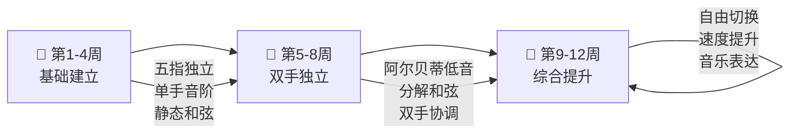

# 🎹 钢琴手指练习计划

> [!abstract] 计划概览
> **起始日期：** 2026-03-16　　**周期：** 12周　　**每日时长：** 1小时
> **参考教材：**
> - 📘 [[什密特钢琴手指练习 教学版 最新修订 (方百里著, 什密特[编] , 方百里注释, 什密特, 方百里, 什密特 etc.) (z-library.sk, 1lib.sk, z-lib.sk).pdf|什密特钢琴手指练习（方百里教学版）]]
> - 📗 [[音阶、和弦与琶音大全 (隆茜编, 隆茜编, 隆茜) (z-library.sk, 1lib.sk, z-lib.sk).pdf|音阶、和弦与琶音大全（隆茜编）]]

---

## 🎯 学习目标

**当前水平：** 能弹奏简单曲子，双手配合（一手和弦 + 一手旋律）有待提升
**12周目标：** 右手流畅演奏旋律，左手自如切换柱式和弦、阿尔贝蒂低音与分解和弦



---

## ⏱️ 每日一小时安排

| 时段 | 时长 | 练习内容 | 参考书目 |
|------|------|---------|---------|
| 🔥 热身 | 5 分钟 | 慢速五指爬音，放松手腕与手指关节 | — |
| 💪 手指练习 | 10 分钟 | 什密特 — 当周指定练习曲 | 什密特 |
| 🎵 音阶 | 10 分钟 | 当周指定调性音阶（单/双手） | 隆茜音阶大全 |
| 🎼 和弦/分解 | 10 分钟 | 当周指定和弦型态练习 | 隆茜音阶大全 |
| 🤝 双手协调 | 10 分钟 | 专项独立性练习（右手旋律 + 左手伴奏型） | — |
| 🎹 曲目 | 15 分钟 | 将本周技巧融入实际曲目练习 | — |

> [!tip] 练习原则
> - **慢练优先**：宁可慢而准确，不要快而错误。速度是准确的奖励。
> - **聆听自己**：每次下键前，在脑中先听到音高。
> - **分手练习**：遇到困难片段，先拆开双手各自练熟，再合并。
> - **少量多次**：一个练习重复 3–5 次即可，过多重复容易巩固错误。

---

## 📅 十二周课程安排

### 🌱 第一阶段：基础建立（第 1–4 周）

> [!info] 阶段目标
> 建立扎实的单手技巧：右手五指独立，左手能稳定保持和弦位置。初步尝试双手同时演奏。

#### 第 1 周

| 模块   | 内容                   | 说明                             |
| ---- | -------------------- | ------------------------------ |
| 什密特  | 练习 No.1–2            | C 大调五指基础位置，各指独立打键，注意指尖触键       |
| 音阶   | C 大调（右手→左手）          | 单手，四个八度，♩=60，注意拇指过渡顺畅          |
| 和弦   | C 大调主三和弦（柱式）         | 左手原位、第一转位、第二转位，慢速连接            |
| 双手协调 | RH 五指练习 + LH 保持 C 和弦 | 右手在 C 位弹什密特 No.1，左手静静保持 C 大三和弦 |

#### 第 2 周

| 模块 | 内容 | 说明 |
|------|------|------|
| 什密特 | 练习 No.3–4 | 强调弱指（4、5 指）的力度均匀 |
| 音阶 | G 大调（单手） | 注意升 F，右手指法 1-2-3-1-2-3-4-5 |
| 和弦 | G 大调主三和弦 | 同第1周方式，加入 G 调 |
| 双手协调 | RH 简单旋律 + LH 交替 C–G 和弦 | 左手只在长拍换和弦，右手保持流动 |

#### 第 3 周

| 模块 | 内容 | 说明 |
|------|------|------|
| 什密特 | 练习 No.5–6 | 注意连奏（legato）与断奏（staccato）对比练习 |
| 音阶 | C 大调双手（同向） | 两手同时，♩=50，优先追求整齐 |
| 和弦 | F 大调 + C–F–G 进行 | 基本的 I–IV–V 和声进行 |
| 双手协调 | RH 旋律 + LH I–IV–V 和弦 | 用"Do Re Mi"等简单旋律配 C 调和声 |

#### 第 4 周（阶段收尾）

| 模块 | 内容 | 说明 |
|------|------|------|
| 什密特 | 练习 No.7–8 | 拇指过渡预备，手腕横移 |
| 音阶 | G 大调双手 | 与 C 大调交替，巩固双手同步 |
| 和弦 | 阿尔贝蒂低音雏形（C 调：1-5-3-5）| 先极慢速，确保每个音颗粒清晰 |
| 双手协调 | **阶段测验**：用一首简单儿歌/民谣 + 左手柱式和弦完整演奏 | 如《小星星》《生日快乐》 |

---

### 🌿 第二阶段：双手独立（第 5–8 周）

> [!info] 阶段目标
> 左手开始"动起来"：掌握阿尔贝蒂低音与简单分解和弦，与右手旋律流畅配合。

#### 第 5 周

| 模块 | 内容 | 说明 |
|------|------|------|
| 什密特 | 练习 No.9–10 | 音型更复杂，注意各指的独立控制 |
| 音阶 | D 大调（单手）、A 大调（单手） | 隆茜第二章，注意升号记号 |
| 和弦 | C 调阿尔贝蒂低音（♩=50） | 根音-高音-中音-高音，确保节奏均匀 |
| 双手协调 | RH 简单旋律 + LH 阿尔贝蒂（♩=50，极慢）| 先各练熟，再逐句合并 |

#### 第 6 周

| 模块 | 内容 | 说明 |
|------|------|------|
| 什密特 | 练习 No.11–12 | 跨越八度的手指练习 |
| 音阶 | D 大调双手 | 配合隆茜书中 D 大调章节 |
| 和弦 | G 调阿尔贝蒂低音 | 扩展到 G 调，加入 I–V 和声 |
| 双手协调 | 阿尔贝蒂与旋律配合，♩=60–70 | 稳步提速，随时回慢 |

#### 第 7 周

| 模块 | 内容 | 说明 |
|------|------|------|
| 什密特 | 练习 No.13–14 | 含手指快速交替与顿音练习 |
| 音阶 | A 大调双手 | 隆茜书 A 大调章节 |
| 和弦 | F 调分解和弦（1–5–3–5 型）| 与阿尔贝蒂对比，感受伴奏风格差异 |
| 双手协调 | RH 旋律 + LH 在阿尔贝蒂与分解间切换 | 同一段旋律，左手换两种伴奏型各弹一遍 |

#### 第 8 周（阶段收尾）

| 模块 | 内容 | 说明 |
|------|------|------|
| 什密特 | 练习 No.15–16 | 综合前两周技巧 |
| 音阶 | 复习 C、G、D、A（双手轮流） | 4 个调各弹一遍 |
| 和弦 | 双手同时演奏 I–IV–V–I | 双手柱式和弦进行，感受和声 |
| 双手协调 | **阶段测验**：能演奏一首含阿尔贝蒂伴奏的曲子 | 如《小奏鸣曲》片段、《欢乐颂》简编版 |

---

### 🌳 第三阶段：综合提升（第 9–12 周）

> [!info] 阶段目标
> 提升速度与音乐表达；能在柱式和弦、阿尔贝蒂低音、琶音之间自由切换，演奏完整的旋律+和声声部。

#### 第 9 周

| 模块 | 内容 | 说明 |
|------|------|------|
| 什密特 | 练习 No.17–18 | 颤音预备练习（2-3、3-4 指快速交替）|
| 音阶 | 降 B 大调、降 E 大调（单手→双手）| 隆茜降号调章节 |
| 和弦 | 属七和弦（G7、C7）练习 | 增加和声色彩 |
| 双手协调 | 节奏对位：右手旋律带切分，左手和弦稳定 | 感受"右手自由、左手稳固"的层次 |

#### 第 10 周

| 模块 | 内容 | 说明 |
|------|------|------|
| 什密特 | 练习 No.19–20 | 快速音阶片段练习 |
| 音阶 | E 大调、B 大调（双手）| 隆茜升号调章节 |
| 和弦 | 琶音基础：C 调（左手一个八度内）| 分解和弦到琶音的过渡 |
| 双手协调 | LH 琶音 + RH 旋律（极慢 ♩=40）| 先对齐拍点，再追求流畅 |

#### 第 11 周

| 模块 | 内容 | 说明 |
|------|------|------|
| 什密特 | 练习 No.21–22 | 含颤音练习（tr 记号）|
| 音阶 | 降 A 大调双手 + 复习任意两调 | 自选薄弱调加强 |
| 和弦 | 多调琶音综合（C、G、F、D）| 隆茜琶音章节 |
| 双手协调 | **综合练习**：同段旋律，左手依次用 ① 柱式 ② 阿尔贝蒂 ③ 分解 ④ 琶音 演奏 | 体会不同伴奏型的音乐效果 |

#### 第 12 周（总结）

| 模块 | 内容 | 说明 |
|------|------|------|
| 什密特 | 练习 No.23–25 | 综合手指技巧 |
| 音阶 | 自选 3 个最弱的调，专项强化 | — |
| 和弦 | 全面复习：音阶 + 和弦 + 琶音各一个调 | — |
| 双手协调 | **12周成果展示**：完整演奏一首包含旋律与和声伴奏的曲子 | 建议：简版《卡农》、《月光奏鸣曲》第一乐章片段 |

---

## 📊 练习记录追踪

> [!example]- 📈 练习打卡统计（Dataview）
> ```dataview
> TABLE WITHOUT ID
>   file.link AS "日期",
>   piano-done AS "完成",
>   piano-notes AS "今日笔记"
> FROM "Personal/Daily Notes"
> WHERE piano-done
> SORT file.name DESC
> LIMIT 30
> ```

> [!example]- 🔥 本月练习天数
> ```dataview
> LIST
> FROM "Personal/Daily Notes"
> WHERE piano-done = true AND date >= date(2026-03-01)
> SORT file.name ASC
> ```

---

## 📝 练习日志

> 在 Daily Notes 里记录每次练习，数据会自动汇总到上方表格。
> 具体格式参见每日笔记中的 **🎹 钢琴练习** 区块。

| 日期 | 当前阶段/周 | 主要收获 | 遇到的困难 |
|------|-----------|---------|----------|
| 2026-03-16 | 第一阶段 第1周 | 开始计划 | — |

